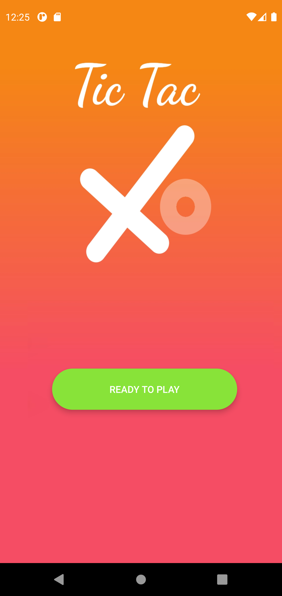
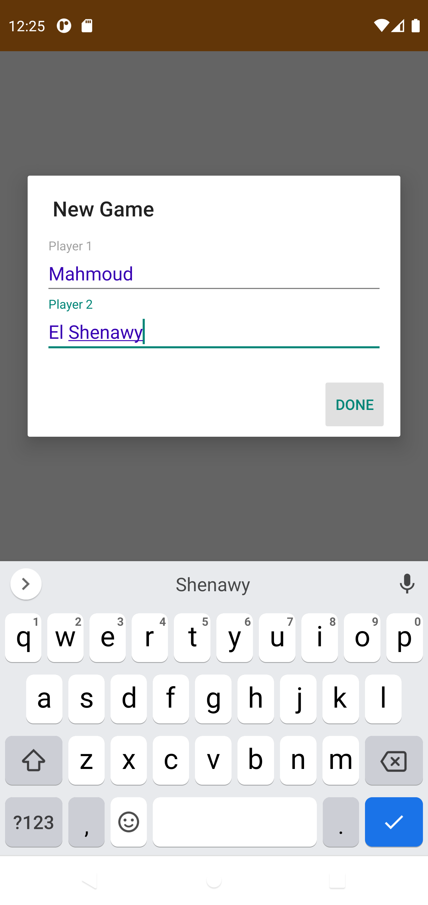
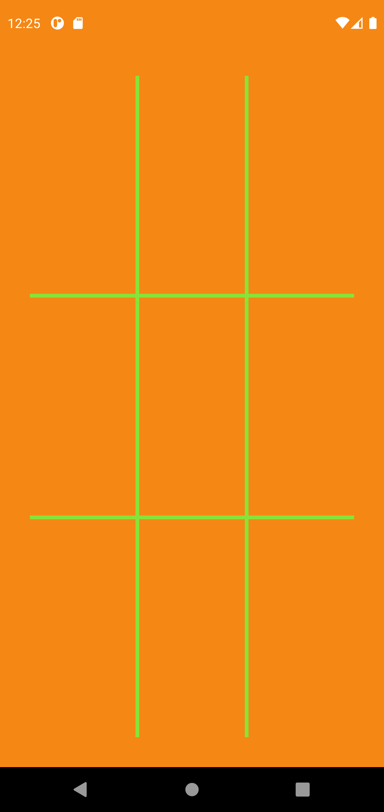
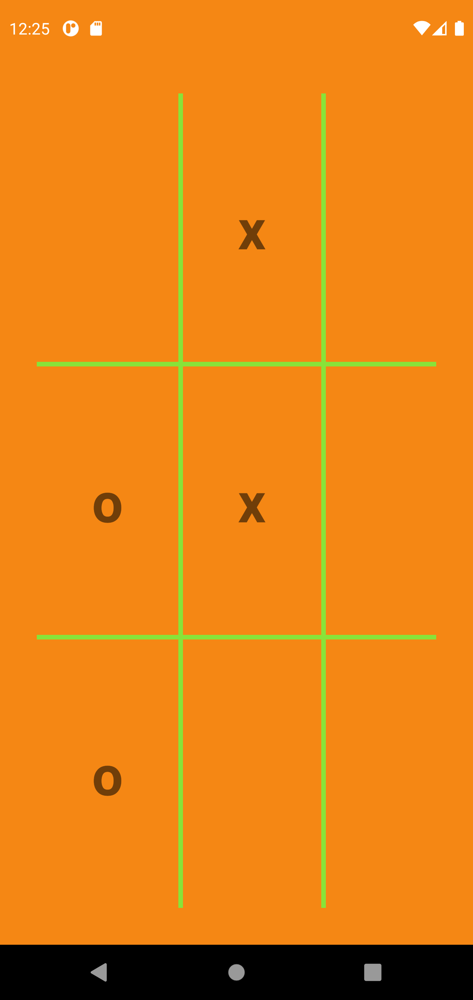

# Movie Home

This is a Simple Tic Tac Game App

# Tools
- MVVM Design Pattern
- Mutable Live Data
- Data Binding
- Observable Array Map

# Features
- Two Player Game

# Screenshots 
There are Some Screenshots to Show How My App Looks. Open Screenshots Folder To See More Pictures

